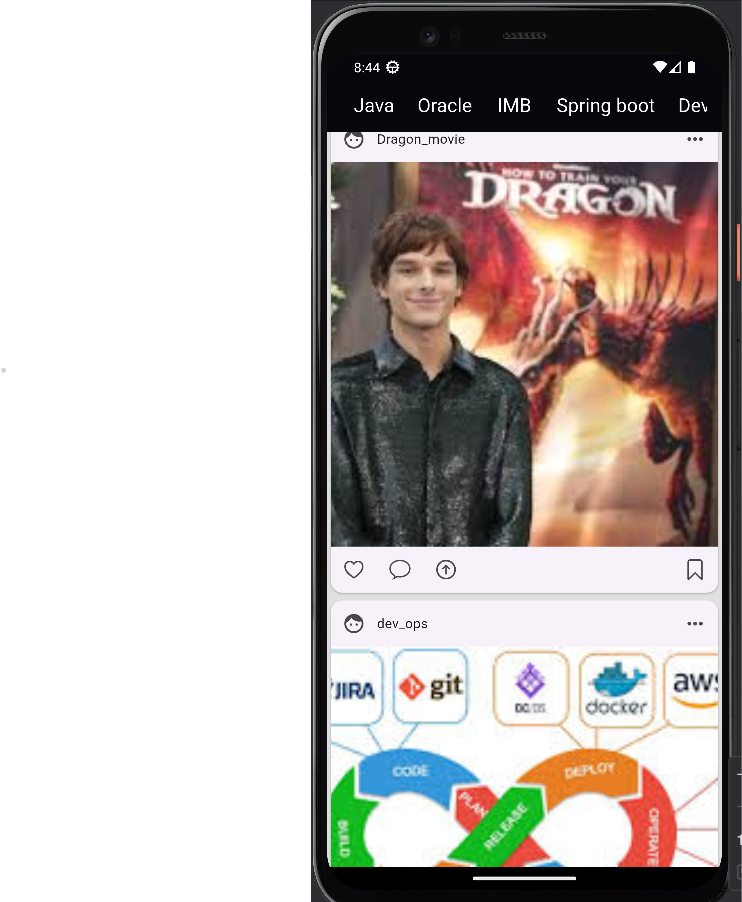

Welcome to flutter 3 with the best guild
1. clone iu makara

   
   

2.Build column list with SingleChildScrollView

  

3.GridView : GridView.count 

- gridView is a show items grid, which is similar to matrix.
- gridView.count used it, if we need to the specific column.
- gridView.count used it, if need to set length maxCrossAxisExtent items.

4. GrideView Page

5. ListViewStory Page

5. Simple App GridViePage Ig, and ListViewStory Page

6.PageView 
- Definition : it has a similar  form ListView, It's Scroll only page 
- Option :
 1. scrollDirection
 2. physics 
 3. controller

7. Tik Tok PageView Builder

8. Custom Scroll View

9. Build Ads

10. build Expended like the telegram boot

